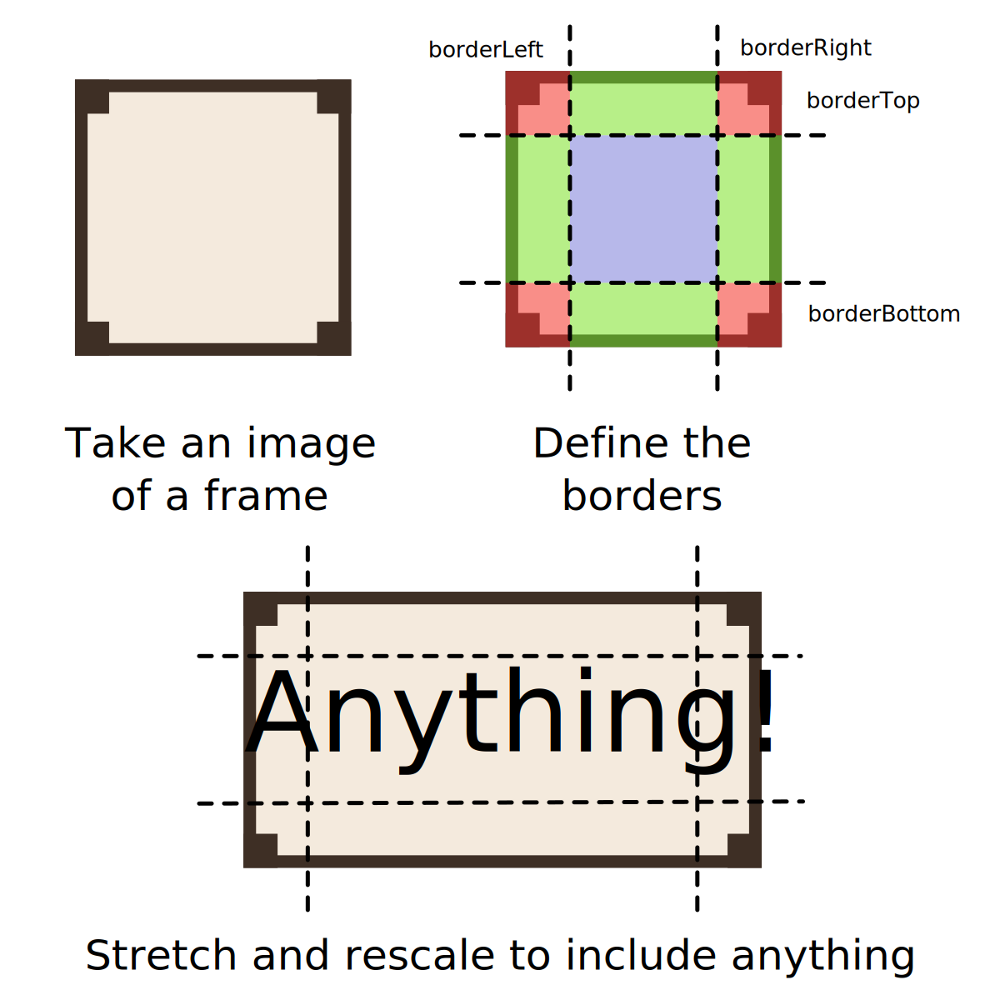

# Nine Patch React

A React component for creating frames with the [nine patch technique](https://en.wikipedia.org/wiki/9-slice_scaling).



## How to install

Just use

```bash
npm install --save @stur86/nine-patch-react
```

or your package manager's equivalent.

## How to use

Import the component like this:

```tsx
import NinePatch from "@stur86/nine-patch-react";
```

And use like this:

```tsx
<NinePatch src="my_frame.png">
Content goes here
</NinePatch>
```

More information in the [demo and documentation page](https://stur86.github.io/nine-patch-react/).

## How to develop

This package was developed using [Bun](https://bun.sh/). The repository uses the workspaces function to host multiple packages, which are:

* `npr`: the core library
* `npr-demo`: the demo and documentation page, built using React and Vite

If you want to propose any new features or fix any bugs, forks and pull requests are welcome! There is a suite of tests you can run with `bun test` inside the `packages/npr` folder, and you can launch the demo page in development mode with `bun run dev` in `packages/npr-demo`.

## Made with

* **React**, obviously
* **Bun** for package managing and testing
* **Vite** for the bundling and building of the demo page
* **Google Fonts** for the demo page itself
* **react-code-block** for the highlighted code in the examples. This in turn uses **Prism** for the actual highlighting. In addition, **react-element-to-jsx-string** was an amazing help as it allowed me to turn the example component into its TSX source code without a need to duplicate it. Extremely convenient!
* **Aseprite** and **Inkscape** for the frames used in the demos